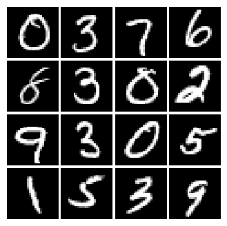
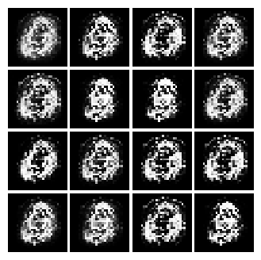
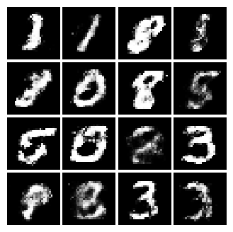

直观地理解GAN


### 基本原理
GAN即生成对抗网络（Generative adversial network），可以用来生成图片、视频等等，不一而足，其应用领域非常广阔呢。其基本原理来源于现实例子，比如警匪片里的警察与歹徒的竞逐。如果警察太厉害，歹徒太弱，这部片就不好看了，反之亦如是。只有当警匪两者势均力敌的时候，才会有你来我往，高潮迭起的剧情。这对于GAN也是一样的。

GAN中的警察，专业术语是判别器（Discriminator），我们叫它小D好了。GAN中的歹徒，我们叫它生成器（Generator），即G。这个G是个盗版商，它根据它所了解，熟悉及掌握的知识，来制造假货出售。一开始，D一下子就识别出真假，G不气馁，再改进，再与D较量。这样日复一日，年复一年，G和D的功力大增。最后的结果是，G制作出来的东西，D分不清是真是假，也就是说，G的造假技术已经炉火纯青了。

这时候会发生什么事情呢？这时候，深度学习研究者就把G拿出来，生成个熊猫啦，恐龙啦，不一而足～～

### Pytorch 极简实现
我使用的环境是`pytorch==1.2.0`, `torchvision==0.4.0`。

#### 第一，导入依赖。
```py
import torch
import torch.nn as nn
import torch.optim as optim
from torch.utils.data import DataLoader
from torchvision.transforms import ToTensor
from torchvision.datasets import MNIST
```

#### 第二，配置参数。
```py
##### settings 
x_dim = 28 * 28 # size of mnist digit
z_dim = 100     # random noise
h_dim = 128     # hidden layer
batch_size = 60000 // 1000
lr = 1e-3
epochs = 120
```
我们所使用的数据集是`MNIST`，对于获取GAN的直观感受再适合不过。`MNIST`的数据是0-9这10个数字的图片，像这样



`MNIST`的图片大小是 28x28，我们设置`x_dim`是把图片展开成1维向量了，因为我们准备使用全连接层，而不是卷积网络。`z_dim`是随机噪声的维度，随机噪声就是G用来生成假数据的原料啦。`h_dim`是隐藏层维度。`batch_size`设置为60，当然可以设置成其他的，只要能整除就行。整除仅仅是为了这份代码能够高效训练。

> 你知道为什么要设成整数倍吗？请在代码里寻找答案！你可能需要跑下代码来发现线索。

`lr`学习率设置为`0.001`，迭代120次。

#### 第三，数据准备。
```py
##### load data and generate targets
# NOTE: we only need train data
trainset = MNIST('../mnist', train=True, transform=ToTensor(), download=True)
dataloader = DataLoader(trainset, batch_size=batch_size, shuffle=True)
# targets for D, who only output 1 for real data, 0 for fake data
real_target = torch.ones(batch_size, 1) 
fake_target = torch.zeros(batch_size, 1)
```
在数据准备一节，我们只下载`MNIST`的训练集，并按`batch_size`生成了一系列的0和1，用于指导D和G的训练。

> 你知道为什么只使用训练集吗？一般不都需要训练集和测试集吗？

#### 第四，网络架构。
```py
##### network arch 
class Generator(nn.Module):
    """generator, generates fake data which is similar to the real data, to 
    fool the discriminator"""

    def __init__(self, z_dim, h_dim):
        super().__init__()
        self.net = nn.Sequential(
            nn.Linear(z_dim, h_dim),
            nn.ReLU(inplace=True),
            nn.Linear(h_dim, x_dim),
            nn.Sigmoid(),
        )

    def forward(self, x):
        x = self.net(x)
        return x


class Discriminator(nn.Module):
    """discriminator, is response for judging whether an input is real data 
    or fake data that generated by the generator"""

    def __init__(self, x_dim, h_dim):
        super().__init__()
        self.net = nn.Sequential(
            nn.Linear(x_dim, h_dim),
            nn.ReLU(inplace=True),
            nn.Linear(h_dim, 1),
            nn.Sigmoid(),
        )

    def forward(self, x):
        x = self.net(x)
        return x
```
简单解释一下，G和D的结构都是双线性网络结构。不同的是，G的输入维度是`z_dim`，输出维度是`x_dim`，因为G要把随机噪声（原材料）制作成赝品。(赝品真的是个好词，它不仅有假的意思，还有能够以假乱真的含义:-)。D的输入维度是`x_dim`，输出维度是1，因为D的任务是判断输入的x是真还是假。

#### 第五，模型初始化。
```py
##### init model
G = Generator(z_dim, h_dim)
D = Discriminator(x_dim, h_dim)
```
当然，我没有专门做权重初始化，只是创建而已，这时`pytorch`会进行随机权重初始化。

#### 第六，设置优化器及损失函数。
```py
##### optimizer and loss
G_optim = optim.Adam(G.parameters(), lr=lr)
D_optim = optim.Adam(D.parameters(), lr=lr)

D_loss_real = nn.BCELoss()
D_loss_fake = nn.BCELoss()
G_loss_f2r = nn.BCELoss()
```
解释一下损失函数。`D_loss_real`用于训练D认识什么是真品，`D_loss_fake`用于训练D什么是赝品，`G_loss_f2r`用于训练G将随机噪声慢慢做成赝品。

#### 第七，训练过程。
```py
##### training loop
G.train()
D.train()
for epoch_i in range(epochs):
    for x, _ in dataloader:
        # step 1: G generate fake data fx using noise z
        z = torch.randn(batch_size, z_dim)
        fx = G(z)

        # step 2: D judge on (fx, x), then update itself
        fake = D(fx)
        x = x.view(-1, x_dim)
        real = D(x)
        D_loss = D_loss_real(real, real_target) + D_loss_fake(fake, fake_target)
        D_optim.zero_grad()
        D_loss.backward()
        D_optim.step()

        # step 3: G update
        z = torch.randn(batch_size, z_dim)
        fx = G(z)
        fake = D(fx)
        G_loss = G_loss_f2r(fake, real_target)
        G_optim.zero_grad()
        G_loss.backward()
        G_optim.step()
```
在训练过程中，我们首先随机生成了噪声`z`，然后`G(z)`生成了假的数据`fx`。注意在第二个`for`循环里，我们从`dataloader`取出了真的数据`x`，所以现在我们有真假两种数据。然后，D对两种数据分别判断，得出结论`fake`及`real`。`D_loss_real(real, real_target)`训练D学会判断真数据，`D_loss_fake(fake, fake_target)`训练它学会判断假数据，我们将之加总，然后反向传播，更新权重。这时D的判断能力得到增强。接着，我们再一次生成噪声`z`及`fx`，然后让D判断，得到`fake`，`G_loss_f2r(fake, real_target)`是训练G去生成更好的赝品，随后我们反向传播更新权重，得到了更好的G。

#### 第八，结果可视化。
```py
    # for each epoch, visualize result
    print(f"Epoch-{epoch_i}: D_loss: {D_loss:.5f}, G_loss: {G_loss:.5f}")
    visual_mnist(epoch_i, fx.detach().numpy()[:16], (4, 4))
```
注意，这里有一层缩进。G的训练效果有多好？除了每一次迭代都打印损失之外，我们还把G的作品`fx`拿出来看看，这里是对前16个赝品进行可视化，组织成 4x4 的方格。`visual_mnist`定义如下：
```py
import os
import matplotlib.pyplot as plt
import matplotlib.gridspec as gridspec


def visual_mnist(epoch, samples, figsize):
    """visualize mnist data

    Args:
        epoch: integer
        samples: numpy format 
        figsize: figure size
    """
    fig = plt.figure(figsize=figsize)
    gs = gridspec.GridSpec(*figsize)
    gs.update(wspace=0.05, hspace=0.05)

    for i, sample in enumerate(samples):
        ax = plt.subplot(gs[i])
        plt.axis('off')
        ax.set_xticklabels([])
        ax.set_yticklabels([])
        ax.set_aspect('equal')
        plt.imshow(sample.reshape(28, 28), cmap='Greys_r')

    os.makedirs('output/', exist_ok=True)
    plt.savefig(f'output/{str(epoch).zfill(3)}.png', bbox_inches='tight')
    plt.close(fig)

```
因为我们的目标是直观理解GAN，所以`visual_mnist`并不在讨论范围之内，放这里是为了代码完整。

#### 第十 训练效果
迭代1次数据集的结果以及迭代50次的结果。迭代120次的效果？手滑已删～～自己跑代码～～




### Tips
+ 你应该要读至少两遍代码或者博客，这样才能全局掌握所有代码片段的关联。
+ 你应该试图去回答那些小问题，以检验你对代码的理解。当然，我的代码写得不好，你也可以不看:-)。

### Next
+ 所有的代码都可以在[Github](https://github.com/siriusdemon/hackaway/tree/master/projects/Gan/GAN)获取。
+ 关注我的[Github Page](https://siriusdemon.github.io/)查看更新。
+ 也可以关注公众号`可食用代码`。


### Wishes
愿所有见过，听说过，忆念以及使用这个仓库的人，都能够获得暂时的快乐与永久不变的快乐。

### Reference & Thanks
+ https://github.com/wiseodd/generative-models