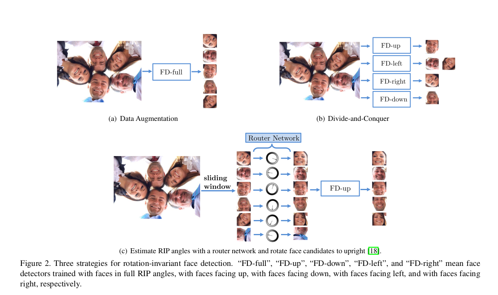
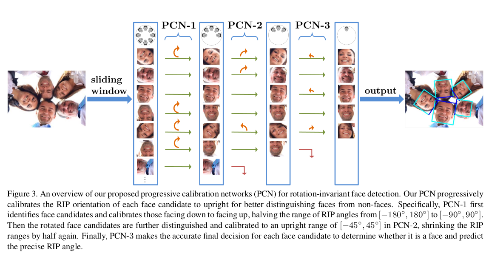
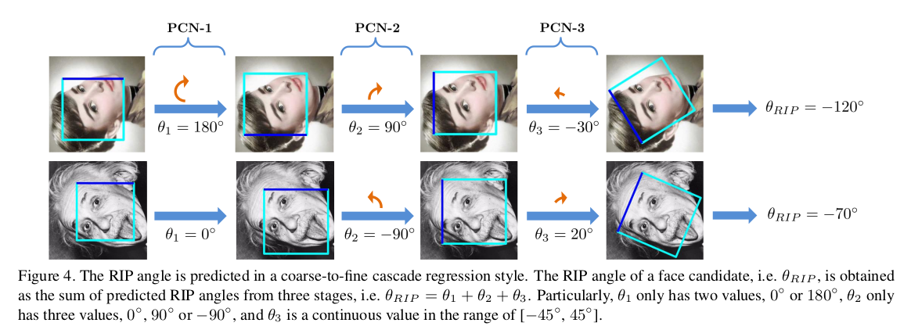
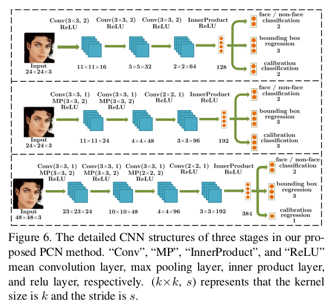
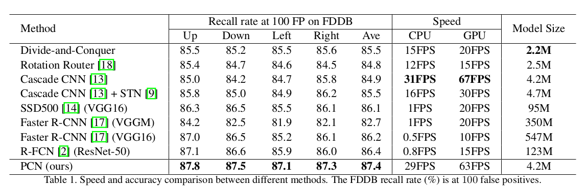

# Real-Time Rotation-Invariant Face Detection with Progressive Calibration Networks

[[paper]](https://arxiv.org/pdf/1804.06039.pdf)

## Overviews
PCN consists of three stages, each of which not only distinguishes the faces from non-faces, but also calibrates the RIP orientation of each face candidate to upright progressively. By dividing the calibration process into several progressive steps and only predicting coarse orientations in early stages, PCN can achieve precise and fast calibration. By performing binary classification of face vs. non-face with gradually decreasing RIP ranges, PCN can accurately detect faces with full 360◦ RIP angles. Such designs lead to a real-time rotation-invariant face detector.

## Previos Work

Generally, there are three strategies for dealing with the rotation variations including data augmentation, divide- and-conquer, and rotation router, detailed as follows.
1. data argumentation:
   + pros: straightforward, without extra operations
   + cons: lead to larger network and higher runtime cost
2. divide-and-conquer:
   + pros: multiple detectors and one for a small range of RIP angles, a small network and low cost time is enough for each detector
   + cons: overall time of all detectors grows and more false alarms are easily introduced
3. rotation router: 
   + pros: estimates the faces' RIP angles explicitly and then rotate them to upright, significantly reducing appearance variations of faces.
   + cons: a large network is usually used to estimate the RIP angles precisely, resulting in high time cost

## this paper: PCN

1. PCN first identifies face candidates and calibrates those facing down to facing up, halving the range of RIP angles from [$−180^◦$, $180^◦$] 1 to [$−90^◦$ , $90^◦$].
2. Then the rotated face candidates are further distinguished and calibrated to an upright range of [$−45^◦$ , $45^◦$], shrinking the RIP range by half again.
3. Finally, PCN makes the accurate final decision for each face candidate to determine whether it is a face and predict the precise RIP angle.

## method design
1. Overall
   + sliding windows and image pyramid principle
   + reject candidates with low face confidences and regress the bounding boxes of remaining face candidates, and calibrates the RIP orientations of the face candidates.
   + after each stage, NMS is applied

2. PCN $1^{st}$ stage
   + objectives: 
     + face/non-face classification
     + bounding box regression
     + calibration
   + formula:
     $$ \large [f, t, g] = F_1(x), \tag 1$$
     where $F_1$ is a small CNN. $f$ is face confidence score, $t$ is bounding box and $g$ is orientation score
   + losses:
     + softmax loss to distinguish face from non-face
       $$ \large L_{cls} = ylogf + (1-y)log(1-f) \tag 2$$
       where $y$ equals 1 if $x$ is face, otherwise is 0.
     + smooth $l_1$ loss for bounding box regression
       $$ \large L_{reg}(t, t^*) = S(t - t^*) \tag 3$$
       where $t$ and $t^∗$ represents the predicted and ground-truth regression results respectively, and $S$ is the smooth $l_1$ defined as follow:
       $$ \large smooth_{L_1}(x) = \begin{cases} 
       0.5x^2 \quad if\ |x| < 1 \\
       |x| - 0.5 \quad otherwise
       \end{cases} \tag 4$$
       The bounding box regression targets consists of three terms: 
       $$ \large t_w = w^* / w , $$
       $$ \large t_a = (a^* + 0.5w^* - a - 0.5w) / w^*, \tag5$$
       $$ \large t_b = (b^* + 0.5w^* - b - 0.5w) / w^*,  $$
       where $a, b$ and $w$ denote the box's top-left coordinates and its width. Variables $a$ and $a^∗$ are for the box and ground- truth box respectively (likewise for $b$ and $w$). 
     + binary loss for coarse orientaion prediction
       $$ \large L_{cal} = y\mathop{log}g + (1-y)\mathop{log}(1-g), \tag 6 $$ 
       where $y$ equals 1 if $x$ is facing up, and equals 0 if $x$ is facing down. 
   + overall loss:
     $$ \large \mathop{min}\limits_{F_1}L = L_{cls} + \lambda_{cal} * L_{reg} + \lambda_{cal} * L_{cal} \tag7$$
   After optimizer Eq.6, the PCN-1 is obtained which can be used to filter all windows to get a small number of face candidates. For the remaining face candidates, firstly they are updated to the new bounding boxes that are regressed with the PCN-1. Then the updated face candidates are rotated according to the predicted coarse RIP angles. The predicted RIP angle in the first stage, i.e. $θ^1$ , can be calculated by: 
   $$ \theta^1 = \begin{cases} 
      0^◦, \quad g \geq 0.5 \\
      180^◦, \quad g < 0.5 \tag 8
      \end{cases}$$ 
   Specifically, $θ^1 = 0^◦$ means that the face candidate is facing up, thus no rotation is needed, otherwise $θ^1 = 180^◦$ means that the face candidate is facing down, and it is rotated $180^◦$ to make it facing up. As a result, the range of RIP angles is reduced from [$−180^◦ , 180^◦$] to [$−90^◦ , 90^◦$]. 
3. PCN $2^{nd}$ stage
   Similar as PCN-1, buf the coarse orientation prediction in this stage is a ternary classification of the RIP angle range, i.e. $[−90^◦, −45^◦], [−45^◦, 45^◦], [45^◦, 90^◦]$. Rotation calibration is conducted with the predicted RIP angle in the second stage:
   $$ id = \mathop{argmax} g_1,
    \begin{cases}
    -90^◦, \quad id = 0 \\
    0^◦, \quad id = 1    \tag9\\
    90^◦, \quad id = 2  
    \end{cases} 
   $$
   where $g_0$ , $g_1$ , and $g_2$ are the predicted ternary orientation classification scores. The face candidates should be rotated by $−90^◦$ , $0^◦$ , or $90^◦$ correspondingly. After the second stage, the range of RIP angles is reduced from [$−90^◦ , 90^◦$ ] to [$−45^◦ , 45^◦$]. In the training phase of the second stage, we rotate the initial training images uniformly in the range of [$−90^◦ , 90^◦$], and filter out the hard negative samples via the trained PCN-1. Positive and suspected samples in the RIP angles range [$−90^◦ , −60^◦$], [$−30^◦ , 30^◦$], [$60^◦ , 90^◦$] correspond to the label 0, 1, 2 for calibration. Samples whose RIP angles are not in the range above will not contribute to the training of calibration.
4. PCN $3^{rd}$ stage
   PCN-3 attempts to directly regress the precise RIP angles of face candidates instead of coarse orientations.   
   At last, the RIP angle of a face candidate, i.e. $θ^{RIP}$, can be obtained by accumulating the predictions from all stages:
    $$ \large \theta_{RIP} = \theta_1+\theta_2+\theta_3\tag{10}$$

   

5. training notes:
   + rotate the training images with different RIP angles to form a new training set containing faces with $360^◦$ RIP angles.
   + positive samples: $IoU \ge 0.7$
   + negative samples: $IoU \le 0.3$
   + suspected samples: $0.3 < IoU < 0.7$
   + Positive samples and negative samples contribute to the training of classification of faces and non-faces. Positive samples and suspected samples contribute to the training of bounding box regression and calibration. For positive and suspected samples, if their RIP angles are in the range of $[−65^◦ , 65^◦]$, we define them as facing up, and if in $[−180^◦ , −115^◦ ] ∪ [115^◦ , 180^◦]$, we define them as facing down. Samples whose RIP angles are not in the range above will not contribute to the training of calibration. 

## network architecture

+ learning rate: 
  $$
  lr = \begin{cases}
    10^3  \quad step \le 7 * 10^4  \\
    10^4  \quad step > 7 * 10^4 
  \end{cases}$$
+ weight decay: $5 * 10^{-4}$ 
+ momentum: 0.9
+ initial: zero-mean Gaussian distribution with standard deviation 0.01 for stable convergence
+ the ratio of positive samples, negative samples, and suspected samples is about 2 : 2 : 1 in every mini-batch

## performance
