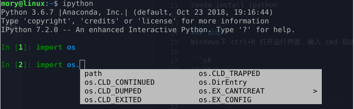
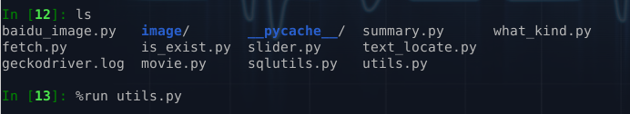
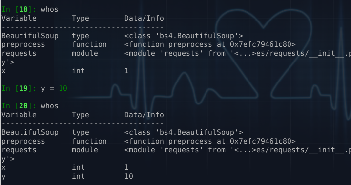
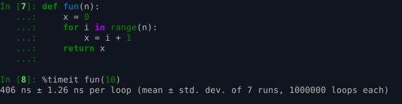

Title: IPython 简介
Date: 2019-10-12 19:23
Modified: 2019-10-12 19:23
Category: python
Tags: python
Authors: siriusdemon
Summary: 

IPython 是一个增强版的Python交互环境，是学习和工作中不可或缺的利器，然而现今 Python 大热，很多人却不了解 IPython，很可惜～赶紧让我们一起来了解下吧 :)

### 安装
你可以用 Python 自带的 pip 来安装 IPython；如果你安装的是 Anaconda 或者 miniconda，也可以用 conda 安装：
```sh
pip install ipython
```
或者
```sh
conda install ipython
```

### 启动
Windows下 win+R 打开运行界面，输入 cmd 启动命令行，Linux 或者 Mac 直接打开终端，输入

```sh
ipython
```
你可以在 ipython 中输入任意合法的 Python 语句，同时获得语法高亮，自动补全等诸多增益～


### 自动补全

这项基本技能，通过 Tab 键触发。



在旧的 python 交互环境中，是不支持 Tab 自动补全的，不过我在 python-3.6.8 及 python-2.7.15的环境中，已经支持代码补全了。

### 多行纠错

你在普通的 python 交互环境中，如果你的代码分行的，比如说定义一个函数，或者写个嵌套的 for 循环。如果你写错了段代码，你是不能按下可爱的 backspace 键去修改的。但 ipython 支持这种修改，不妨试试下面的例子～


### 加载脚本

加载脚本的功能是 ipython 最常用的功能，没有之一。假如我有一个脚本 great_functions.py 里面定义了很多有用的函数，我想测试这些函数，可以一次性把它们加载进 ipython，在交互环境里慢慢玩～

ipython 加载脚本的技能通过魔术命令 %run 触发



如图，在 ipython 中运行 ls，列出当前目前下的文件，然后通过 %run 把 utils.py 加载进来。这样 utils.py 里定义的变量、函数以及导入的模块都会在 ipython 中可见。

### 查看变量

ipython 中都已经有什么变量了？可以通过 whos 查看。



如图，whos 可以显示环境中的变量，类型以及数据信息。我们在第19个输入定义了新变量 y，可以通过 whos 查得其值。

### 复制代码

在一些旧的 python 版本里，如果你从文件复制代码到剪贴板，然后粘贴到 python 交互环境，代码的缩进是会有变化的。ipython 提供了魔术命令 %paste 来粘贴代码。不过，最新的 python 交互环境似乎已经支持啦！

### 测速命令

ipython 另一个神器就是测速魔术命令 %timeit，可以直接测试某个函数的运行时间~



%timeit 接受一个函数作为输入，根据需要运行函数 N 次，来计算函数运行一次的平均时间。如果函数本身运行时间比较长，相应的 N 会比较小。

### 其他

IPython 还提供了可视化，并行等其他功能，不过日常工作中似乎比较少用到。之前有人问某 Python 大神：你工作都是用什么环境？大神说，我就是打开一个代码编辑器和 IPython。 That's it!
