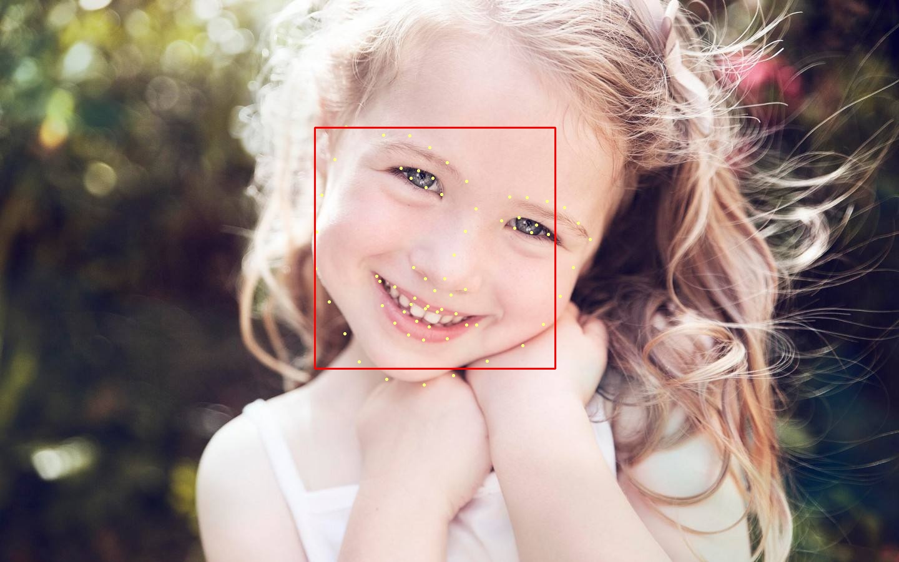

# Face Landmark Detection
Convert Caffe model from this [repo](https://github.com/lsy17096535/face-landmark/blob/master/face_landmark.py)

## Dependences
+ dlib
+ opencv
+ torch
+ imutils

## Usage
```
python demo.py
```


## Installation
```
cd landmark
pip install .
```