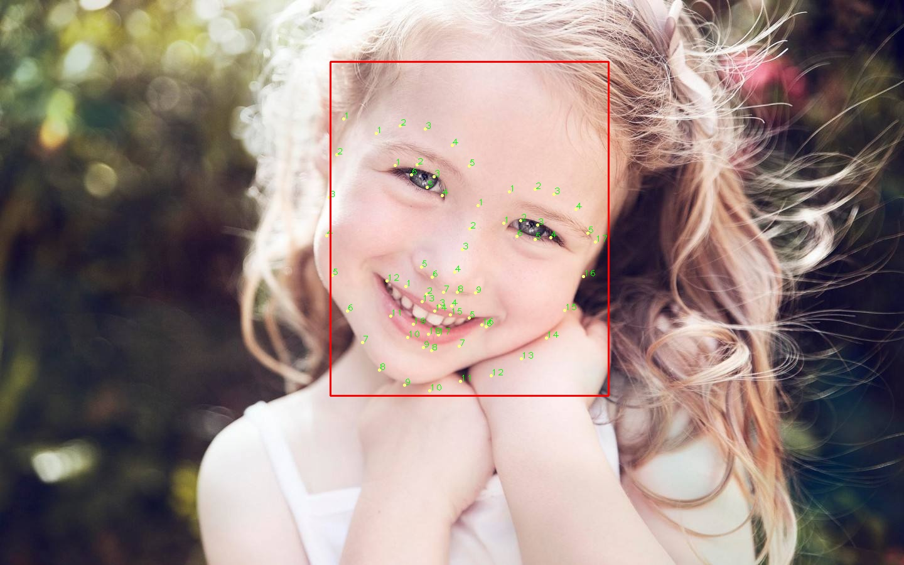

# Face Landmark Detection
Convert Caffe model from this [repo](https://github.com/lsy17096535/face-landmark/blob/master/face_landmark.py)


## Getting Started
This repo use the following package, make sure you have already installed all of them.
+ opencv
+ torch
+ facessh

```bash
pip install opencv-python torch
```
To install `facessh`, switch to `facessh` then run 
```bash
python setup.py develop
```


## Usage
We provide two function `show` and `detect`. Refer to `demo.py` for usage. 
```bash
python demo.py
```

## Results


## Installation
```bash
cd landmark
pip install .
```

## Reference
+ [Procrustes Analysis](https://www.cnblogs.com/nsnow/p/4745730.html)
+ [cv2 alignment](https://blog.csdn.net/oTengYue/article/details/79278572)
+ [swapface](https://matthewearl.github.io/2015/07/28/switching-eds-with-python/)