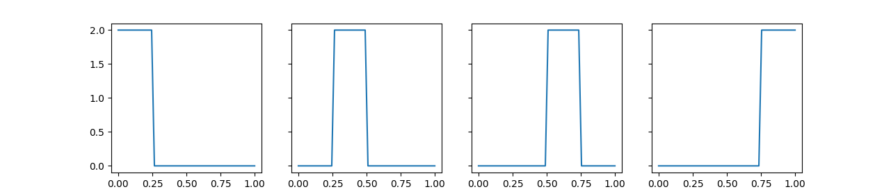
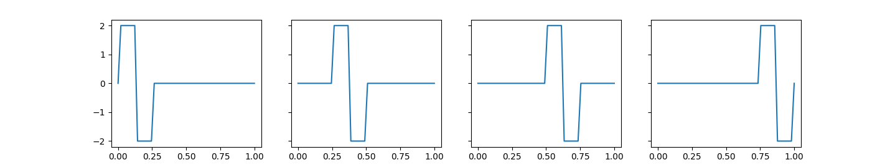

# 哈尔小波

因为看了好几次没看懂，所以做个笔记。

### $L^2(0,1)$空间
$L^2(0,1)$表定义在闭区间(0,1)的平方可积的函数的线性空间(linear space of square (Lebesgue) integrable real-valued functions on the interval (0, 1))。定义两个运算：

内积(inner product):
$$
    (f, g) = \int_0^1 f(x)g(x)dx \tag{1}
$$

求模(norm):
$$
    ||f||^2 = (f, f) = \int_0^1 |f(x)|^2dx, \quad f,g \in L^2(0,1) \tag{2}
$$

求模运算满足三角不等式：
$$
    ||f - g|| \le ||f - b|| + ||b - g|| \quad \forall f, g, h \in L^2(0,1) \tag{3}
$$
因此可见，$||f-g||$是对$f$和$g$之间距离的一种度量。

内积是对矩阵空间$R^n$的点乘运算的一种泛化。因此，如果$(f,g)=0$，则说$f,g$是正交的。正交集合$F \subset L^2(0,1)$表示，其中每一对函数都是正交的。如果对于$F$中的每一个函数，都满足$||f|| = 1, \forall f \in F$，则说$F$是标准正交集。

与矩阵空间的向量分解(vector decomposition)相似，如果对于任意一个函数$f \in L^2(0,1)$，可以表示成:
$$
    f = \sum \limits_{i=1}^\infin (f, f_i)f_i = (f, f_1)f_1 + (f, f_2)f_2  + ..., \tag{4}
$$
我们说标准正交集合$F=\{f_i\}^\infin_{i=1} \subset L^2(0,1)$是一个线性空间$L^2(0,1)$的完全标准正交基(complete orthonormal basis)。
在这里，这个无穷和(infinite sum)称为函数$f$基于$F$的广义傅里叶级数。

哈尔的贡献在于，给出了一种构造$F$的方法。

### 哈尔构造法
选取一个大于0的整数$j$，将闭区间(0,1)平均分成$2_j$份，这些断点构成了一个向量，如下
```py
j = 2
V_j = [i / 2**j for i in range(2**j+1)]
print(V_j)
# [0.0, 0.25, 0.5, 0.75, 1.0]
```
令$V_j$为常数分段函数(piecewise-constant function)的集合，其中的函数在断点$i/2^j$处不连续。很显然，$V_j \subset L^2(0,1)$。

现在，为了在$V_j$中构造一个标准正交基$F_j$，定义$φ: R \rightarrow R$ 如下
$$
    φ(x) = \left\{
        \begin{aligned}
            1 & \quad if \ 0 \le x \le 1  \\
            0 & \quad otherwise 
        \end{aligned}
    \right.
$$

并且，对于任意的 $i = 0,1,...,2^j-1$, 令
$$
    φ_i^j(x) = 2^{j/2}φ(2^jx - i), \quad 0 \le x \le 1 \tag{5}
$$

然后令$F_j = \{φ_i^j\}_{i=0}^{2^j-1}$。注意，在$φ_i^j$中的$j$只是上标，不是指数。至此，$F_j$构造完毕。

```py
# φ definition
def Phi(x):
    if 0 <= x <= 1:
        return 1
    else:
        return 0
# continues with all the code block before
# we have j and V_j already
# we discard j in the name for fixed j.
def Phi_ifn(i):
    def Phi_i(x):
        val = 2**(j/2) * Phi(2**j * x - i)
        return val
    return Phi_i
# obviously, this φ_i^j a function
```
我们的标准正交基$F_j$中有$2^j$个函数。

### 研究$F_j$

接下来研究一下$F_j$。先研究$F_2 = \{φ_0^2, φ_1^2, φ_2^2, φ_3^2\}$
```py
F_2 = [Phi_ifn(i) for i in range(2**j)]

def visual_fn(F_j, figsize):
    fig = plt.figure(figsize=figsize)
    gs = gridspec.GridSpec(*figsize)

    xs = np.linspace(0, 1, 50)
    for i, fn in enumerate(F_j):
        ax = plt.subplot(gs[i])
        y = [fn(x) for x in xs]
        ax.set_aspect('auto')
        plt.plot(xs, y)
    plt.show()

visual_fn(F_2, [1, 4])
```
得到的结果


很显然，$V_2$中所有的函数都可以用$F_2$中函数的线性组合，所以$F_2$是$V_2$的一个基。此外，因为$V_2$的基有四个函数，所以定义$V_2$的维度，$dim \ V_2 = 4$。同时$F_2$也是正交的。即：
$$
    (φ_{i_1}^2, φ_{i_2}^2) = \int_0^1 φ_{i_1}^2(x) φ_{i_2}^2(x)dx = 0 \quad if \ i_1 \ne i_2 \tag{6}
$$
这是因为任意两个函数的非零部分没有重叠。公式5中的系数$2^{j/2}$是有意选择的，目的是$F_i$中的每个函数的模都为1，如：
$$
    \int_0^1|φ_i^j(x)|^2 dx = (2^{j/2})^2 \times 2^{-j} = 1 \quad \forall \ j \tag{7}
$$
因此，$F_2$是$V_2$的一个标准正交基。

### 扩展
上一节的观察可以很直接地扩展到任意大于等于0的$j$。因此，$F_j$是$V_j$的一个标准正交基，且$dim \ V_j = 2^j$。

空间$V_j$有以下特性：
$$
    V_0 \subset V_1 \subset V_2 \subset ... \subset L^2(0, 1) \tag{8}
$$

对于每一个$j$，令$W_j$为$V_j$在$V_{j+1}$的一个正交补集。写作：$V_{j+1} = V_j ⊕ W_j$ 。因为$dim \ V_{j+1} = 2^{j+1} = 2 \times 2^j$ 且 $dim \ V_j = 2^j$，所以$dim \ W_j = 2^j$。所以$V_{j+1}$可以唯一分解成两个子空间$V_j$和$W_j$ 。

为了构造$W_j$的标准正交基，定义一个函数$ψ: R \rightarrow R$ 如下：
$$
    ψ(x) = \left\{
        \begin{aligned}
            +1 & \quad if \ 0 < x < \frac{1}{2}  \\
            -1 & \quad if \ \frac{1}{2} < x < 1  \\
            0 & \quad otherwise 
        \end{aligned}
    \right. \tag{9}
$$
且对于任意 $i=0, 1, ..., 2^j - 1$，集合
$$
    ψ_i^j(x) = 2^{j/2} ψ(2^j x − i),  0 ≤ x ≤ 1. \tag{10}
$$
令 $F_j^`= \{ψ_i^j\}_{i=0}^{2^j-1}$。这个$F_j^`$也有与$F_j$同样的性质，即其中每个函数都是正交的，模均为1。因此$F_j^`$是一个标准正交基。另外，我们可以观察到，所有在$F_2^`$的元素都在$V_3$里面。



我们可以进一步拓展，对于任意大于等于0的$j$，有以下推论
- $F_j^`$ 是一个标准正交集合
- ${F_j^`}$与$V_j$正交
- $F_j^` \subset V_{j+1}$

记得吗，$W_j$是$V_j$关于$V_{j+1}$的正交补集，所以$F_j^` \subset W_j$。但因为$dim \ F_j^` = dim \ W_j^`$，所以$F_j^`$是$W_j$的一个标准正交基。

在现代小波理论的术语中，$V_j$的基函数$φ_i^j$叫作哈尔标度函数，$W_j$的基函数$ψ_i^j$称为哈尔小波。


此外，因为函数$2^{-j/2}φ_i^j$以及$2^{-j/2}ψ_i^j$的振幅都是1，因此
$$
    2^{-(j-1)/2}φ_i^{j-1} = 2^{-j/2}φ_{2i}^j + 2^{-j/2}φ_{2i+1}^j, \\
    2^{-(j-1)/2}ψ_i^{j-1} = 2^{-j/2}φ_{2i}^j - 2^{-j/2}φ_{2i+1}^j, 
$$
解得
$$
    φ_i^{j-1} = \frac{1}{\sqrt{2}} (φ_{2i}^j + φ_{2i+1}^j),\ i = 0,1,...,2^{j-1}-1  \tag{11a} 
$$
$$
    ψ_i^{j-1} = \frac{1}{\sqrt{2}} (φ_{2i}^j - φ_{2i+1}^j),\ i = 0,1,...,2^{j-1}-1 \tag{11b}
$$
这将$V_{j-1}$和$W_{j-1}$表示成$V_j$中函数的线性组合。实际上，这就是$V_j=V_{j-1}⊕W_{j-1}$的具体实现。


### 解析$V_j = V_{j-1} ⊕ W_{j−1}$
先定义两个符号，这两个符号是两个标量，分别是：
$$
    \alpha_i^j = (f, φ_i^j)， \beta_i^j = (f, ψ_i^j)，where \ f \in L^2(0,1) \tag{12}
$$
代入公式(11a)和(11b)，有
$$
    \alpha_i^{j-1} = (f, φ_i^{j-1}) = (f, \frac{1}{\sqrt{2}} (φ_{2i}^j + φ_{2i+1}^j)) = \frac{1}{\sqrt{2}}(\alpha_{2i}^j + \alpha_{2i+1}^j), \\
    \beta_i^{j-1} = (f, ψ_i^{j-1}) = (f, \frac{1}{\sqrt{2}} (φ_{2i}^j - φ_{2i+1}^j)) = \frac{1}{\sqrt{2}}(\alpha_{2i}^j - \alpha_{2i+1}^j)
$$
上式给出了解析$V_j$的另一种形式：对于任意函数 $f \in V_j$，有定理
$$
    \alpha_i^{j-1} = \frac{1}{\sqrt{2}}(\alpha_{2i}^j + \alpha_{2i+1}^j), \quad i = 0, 1, ..., 2^{j-1}-1, \tag{13a}
$$
$$
    \beta_i^{j-1} = \frac{1}{\sqrt{2}}(\alpha_{2i}^j - \alpha_{2i+1}^j), \quad i = 0, 1, ..., 2^{j-1}-1, \tag{13b}
$$

写成矩阵形式，有
$$
    \begin{pmatrix} \alpha_i^{j-1} \\ \beta_i^{j-1} \end{pmatrix} = 
    \begin{pmatrix} \frac{1}{\sqrt{2}} & \frac{1}{\sqrt{2}}
                    \\ \frac{1}{\sqrt{2}} & -\frac{1}{\sqrt{2}} 
    \end{pmatrix}
    \begin{pmatrix} \alpha_{2i}^j \\ \alpha_{2i+1}^j \end{pmatrix} \tag{14}
$$
这个2x2的系数矩阵是一个正交矩阵，且其逆矩阵等于它本身。因此，我们对上式求逆，可得
$$
    \begin{pmatrix} \alpha_{2i}^j \\ \alpha_{2i+1}^j \end{pmatrix} = 
    \begin{pmatrix} \frac{1}{\sqrt{2}} & \frac{1}{\sqrt{2}}
                    \\ \frac{1}{\sqrt{2}} & -\frac{1}{\sqrt{2}} 
    \end{pmatrix}
    \begin{pmatrix} \alpha_i^{j-1} \\ \beta_i^{j-1} \end{pmatrix}  \tag{15}
$$
由此，我们有定理
$$
    \alpha_{2i}^j = \frac{1}{\sqrt{2}} (\alpha_i^{j-1} + \beta_i^{j-1}), \ i=0,1,...,2^{j-1}-1 \tag{16a}
$$
$$
    \alpha_{2i+1}^j = \frac{1}{\sqrt{2}} (\alpha_i^{j-1} - \beta_i^{j-1}), \ i=0,1,...,2^{j-1}-1 \tag{16b}
$$

这对于我们接下来的计算非常有帮助。

### 从函数到向量
基于在式(12)中定义符号以及定理(13a)(13b)，可以将任意函数$f \in V_j$改写成：
$$
    f = \sum \limits_{i=0}^{2^j-1} \alpha_i^j φ_i^j \tag{17}
$$
> 个人理解，因为$a_i^j=(f, φ_i^j)$，所以$a_i^j$的几何意义为$f$在基$φ_i^j$上的分量，所以上式是用基的线性组来表示$f$。

这就把任意函数$f \in V_j$跟唯一一个向量$x = [\alpha_0^j,\alpha_1^j,...,\alpha_{n-1}^j] \in R^n$关联起来了，其中$n=2^j=dim \ V_j$。反之，对于$R^n$中的任意向量，在$V_j$中存在个唯一对应的函数。这种关联保持的空间的代数结构(algebraic structure of space)，即：如果$V_j$中的$f$和$g$与$R^n$中的$x$和$y$相关联，那么对于任意$a,b \in R$，函数 $af+bg$ 对应于$ax+by$ 。此外，如果我们定义$x \in R^n$的模为$||x|| = (\sum^{n-1}_{i=0}|\alpha_i^j|^2)^{1/2}$，那么则有$(f,g) = x · y$ 且 $||f||=||x||$。也就是说，这种关系是同质的(isomorphism)。

从这里开始，我们就已经偏离了哈尔的原工作目标了。通过函数空间与向量空间的同质性，我们从函数空间转移到了向量空间。

我们将研究上节定义的两个定理：(13)和(16)。令$j=3$，因为$V_3 = V_2 ⊕ W_2$，则对于$f \in V_3$，有两种表示法:(1)函数基$F_3$的线性组合;(2)函数基$F_2,F_2^`$线性组合之和。
$$
    f = α_0^3 φ^3_0 + α_1^3 φ^3_1 + α_2^3 φ^3_2 + α^3_3 φ^3_3 + α_4^3 φ^3_4 + α_5^3 φ^3_5 + α_6^3 φ^3_6 + α_7^3 φ^3_7 \\
    f = (α_0^2 φ_0^2 + α_1^2 φ_1^2 + α_2^2 φ_2^2 + α_3^2 φ_3^2) + 
        (β_0^2 ψ_0^2 + β_1^2 ψ_1^2 + β_2^2 ψ_2^2 + β_3^2 ψ_3^2)
$$
第一种表示法与以下8维向量关联
$$
    [α_0^3 \quad α_1^3 \quad α_2^3 \quad α_3^3 \quad α_4^3 \quad α_5^3 \quad α_6^3 \quad α_7^3] \tag{18}
$$
第二种表示法有两个4维向量，这里调整了它们的位置，组合成8维向量如下
$$
    [α_0^2 \quad β_0^2 \quad α_1^2 \quad β_1^2 \quad α_2^2 \quad β_2^2 \quad α_3^2 \quad β_3^2] \tag{19}
$$

由公式13、16,有
$$
    \begin{pmatrix} 
        α_0^2 \\ β_0^2 \\ α_1^2 \\ β_1^2 \\ α_2^2 \\ β_2^2 \\ α_3^2 \\ β_3^2 
    \end{pmatrix} = 
    \begin{pmatrix} 
        \frac{1}{\sqrt{2}} & \frac{1}{\sqrt{2}} \\
        \frac{1}{\sqrt{2}} & - \frac{1}{\sqrt{2}} \\
        & & \frac{1}{\sqrt{2}} & \frac{1}{\sqrt{2}} \\
        & & \frac{1}{\sqrt{2}} & - \frac{1}{\sqrt{2}} \\
        & & & & \frac{1}{\sqrt{2}} & \frac{1}{\sqrt{2}} \\
        & & & & \frac{1}{\sqrt{2}} & - \frac{1}{\sqrt{2}} \\
        & & & & & & \frac{1}{\sqrt{2}} & \frac{1}{\sqrt{2}} \\
        & & & & & & \frac{1}{\sqrt{2}} & - \frac{1}{\sqrt{2}} \\
    \end{pmatrix}  
    \begin{pmatrix} 
        α_0^3 \\ α_1^3 \\ α_2^3 \\ α_3^3 \\ α_4^3 \\ α_5^3 \\ α_6^3 \\ α_7^3
    \end{pmatrix}  
$$

这是矩阵的对角线分块，说明这种变换是局部的。因此，向量(18)到向量(19)的变换可以用滑动窗口来完成。这也就是我们后面具体实现时所使用的方法。

### 哈尔小波变换
因为$V_j = V_{j-1} ⊕ W_{j-1}$，同样的，$V_{j-1} = V_{j-2} ⊕ W_{j-2}$，由此可得
$$
    V_j = V_0 ⊕ W_0 ⊕ W_1 ⊕ ... ⊕ W_{j-1} \tag{20}
$$
上式称为空间$V_j$的小波解析(wavelet decomposition of the space $V_j$)。其中各部分的基的并集
$$
    U_j = F_0 ∪ F_0^` ∪ F_1^` ∪ ...  ∪ F_{j-1}^`
$$
是$V_j$的标准正交基，称为空间$V_j$的哈尔小波基(haar wavelet basis)，其线性组合的系数称为函数的哈尔小波系数(haar wavelet coefficients)。
举例来说，如果函数 $f \in V_3 = V_0 ⊕ W_0 ⊕ W_1 ⊕ W_2$，则有
$$
    f = α_0^0 φ_0^0 + β_0^0 ψ_0^0 + β_0^1 ψ_0^1 + β_1^1 ψ_1^1 + 
        β_0^2 ψ_0^2 + β_1^2 ψ_1^2 + β_2^2 ψ_2^2 + β_3^2 ψ_3^2 
$$
小波系数为 $[α_0^0 \ β_0^0 \ β_0^1 \ β_1^1 \ β_0^2 \ β_1^2 \ β_2^2 \ β_3^2]$。

**备注** 空间$V_0$是在区间[0,1]的常函数。在小波$W_i$中的每一个函数都是零均值的。固此，在式(20)的解析中，$V_0$将$f$的均值提升至区间[0,1]。随着小波函数的增加，将更多的微调融入均值中，最后构造出$f$。


### 参考

+ Programming Projects in C for Students of Engineering, Science, and Mathematics
