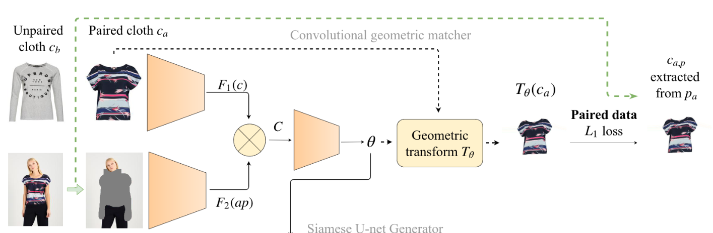

# Warp Unet Try ON 

[End-to-End Learning of Geometric Deformations of Feature Maps for Virtual Try-On](https://arxiv.org/abs/1906.01347v1)   
Pytorch 实现

## 1. Wishes
所有见到，听到及使用此仓库的人，都能得到暂时的快乐与永久不变的快乐。

## 2. Introduction

WUTON 是一种端到端的网络架构，用于虚拟试衣系统。

### 2.1 Network 
#### GMM
几何形变匹配模块（Geometric match module），使用一对成对（*pair*）数据（衣服、穿此衣服的模特），将模特身上的衣服用人体解析系统，将上衣部分解析下来，同时掩去模特身上的衣服。然后将（衣服、掩去衣服的模特）作为输入，训练一个TPS变换的参数$\theta$，用模特的上衣与经过变换的上衣作监督训练。
  
如图:

这里截取了论文原图的上部分，从论文的阐述来看，左上角的衣服在这个 GMM 的过程是没有发挥作用的。作者放在这里造成了我的困惑。

GMM的输出是一个变换，即图中间的 Geometric transform $T_\theta$ 。在生成模块中（即下面要讲的Unet），对衣服的多个特征图应用变换。这也是与`cp-vton`不同的地方，后者是在原图片上应用此变换。

#### Unet
生成器模块（generator）。有两对输入，与 GMM 相同的成对的（衣服，掩去衣服的模特）以及不成对的（*unpair*）的数据（另一件衣服，训练GMM的掩去衣服的模特）。使用不同的编码器（Encoder）对其编码之后，衣服的多个特征图应用来自GMM的变换，然后与模特的特征图一起输入到解码器（Decoder），解码器则将两个输入进行融合，生成两个输出：一个是GMM模特的模拟图，另一个是穿上新衣服的 GMM 横特。GMM 模特的模拟图与原图直接用 L1 loss 和 Perceptual loss 进行训练。穿新衣服的 GMM 模特则与原图一起，作为一个判别器的输入，判别器的 loss 为2019年GAN领域的新秀 Relativistic adversarial loss 。

### 2.2 Data
我们采用[cp-vton](https://github.com/sergeywong/cp-vton#data-preprocessing)的数据。因为论文中提到的数据已经无法下载了。

cp-vton的数据已经提供了 parsing 和 pose 的数据，所以我们直接用就好了。我们需要把模特的上衣取下来，同时掩去模特的上衣及双手，在模特的脖子处画个矩形。这样数据就预处理完成了。

## 3. Code Implementation and explanation

### 3.1 GMM

### 3.2 Unet

### 3.3 Discriminator

### 3.4 Data
见`generate_masked_data.py`，基于`cp-vton`所提供的解析图片，生成的 mask 还是有瑕疵的。

## 4. Payment
如果你喜欢本文，可以考虑购买哦。

